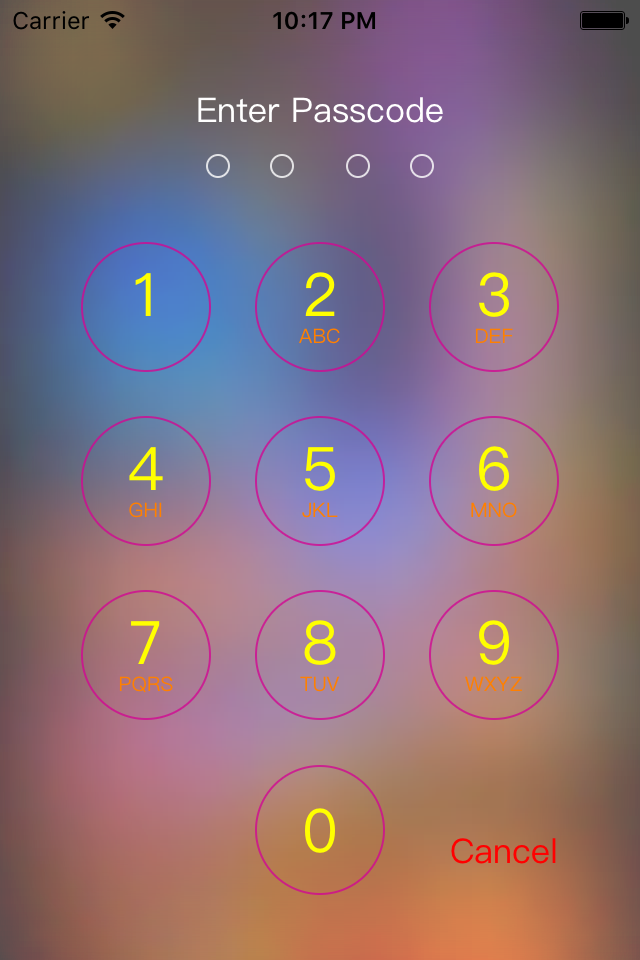
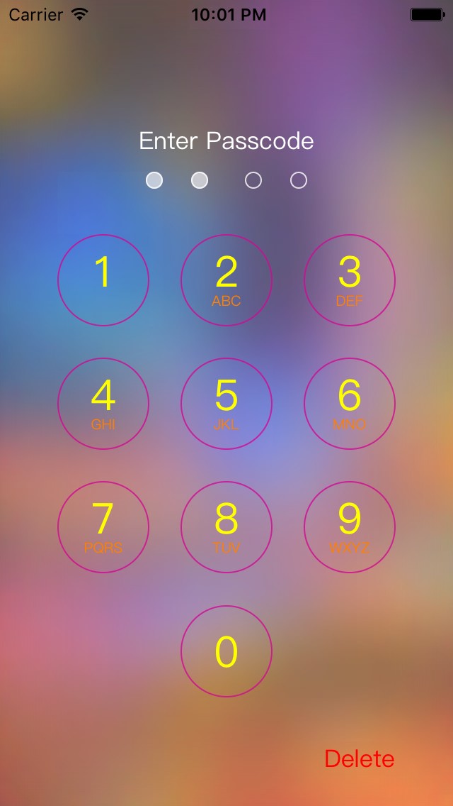
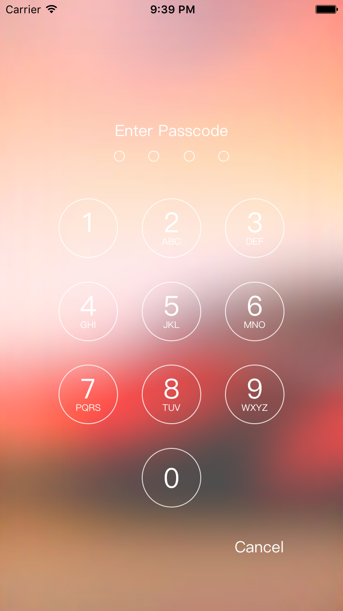
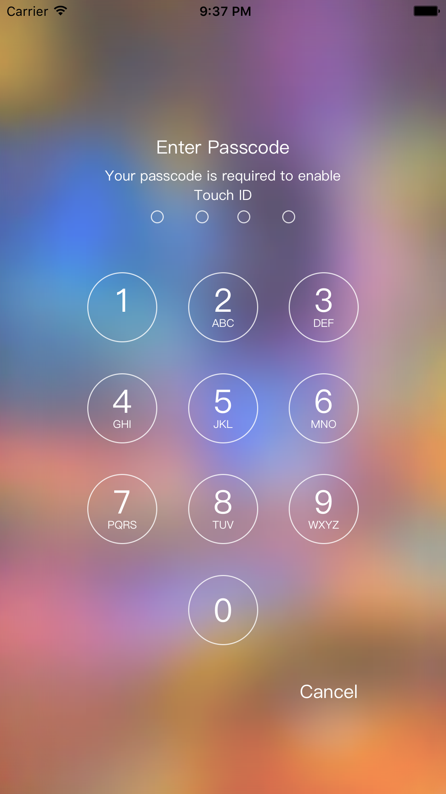
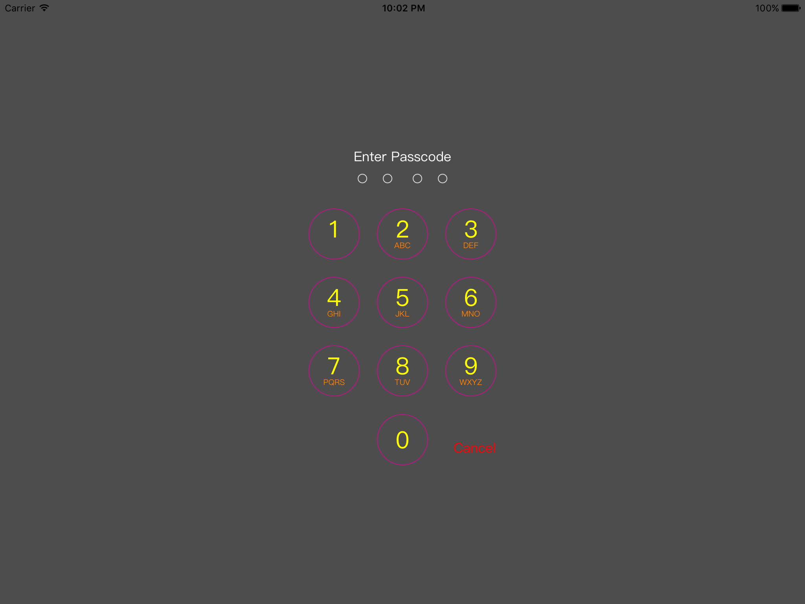
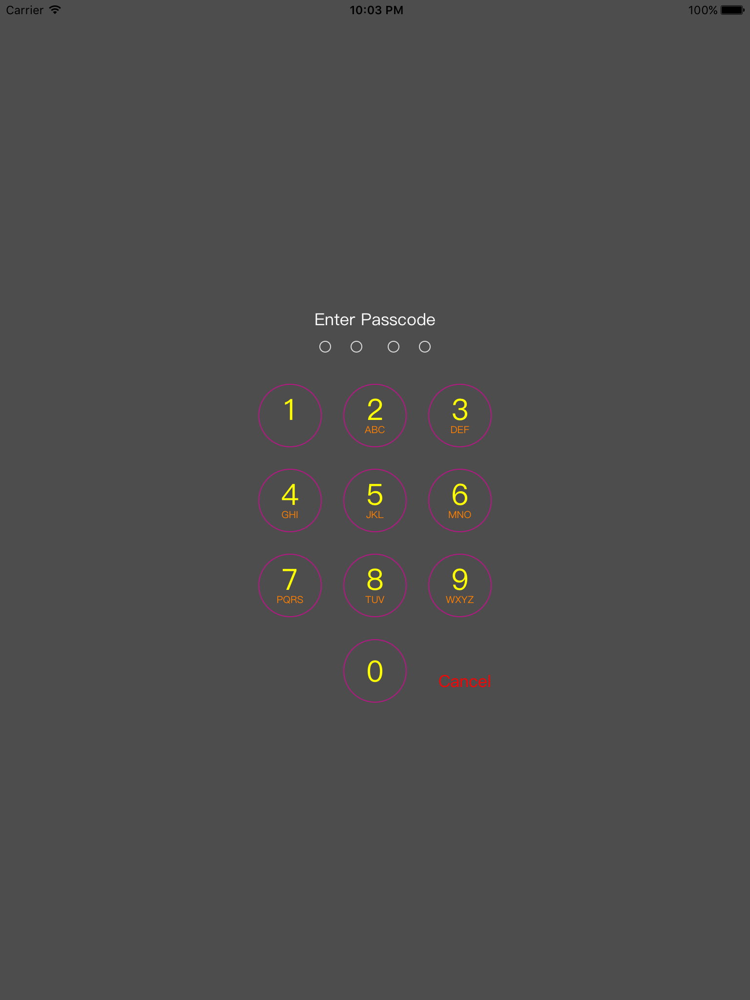

# SAPinViewController
[](https://travis-ci.org/siavashalipour/SAPinViewController)
[](http://cocoapods.org/pods/SAPinViewController)
[](http://cocoapods.org/pods/SAPinViewController)
[](http://cocoapods.org/pods/SAPinViewController)

Simple and easy to use default iOS PIN screen. This simple library allows you to draw a fully customisable PIN screen same as the iOS default PIN view.
My inspiration to create this library was form [THPinViewController](https://github.com/antiraum/THPinViewController), however ```SAPinViewController``` is completely implemented in ```Swift```. Also the main purpose of creating this library was to have simple, easy to use and fully customisable PIN screen.
## Features
- Support both iPhone and iPad landscape/portrait
- Designed with the help of [SnapKit](https://github.com/SnapKit/SnapKit)
- Fully customisable:
	- change title font/colour
	- change subtitle font/colour
	- change numbers font/colour
	- change alphabet font/color
	- change numbers boundary colour
	- change PIN dots color
	- add solid background colour
	- add custom image as background and gets blurred automatically
	- hide alphabets
	- change cancel button font/colour
	- ###### NEW in 0.1.2: 
		- now you can have your logo on top as well
		- now you can have rounded rect as well as circle type UI
	
## Usage
```swift
// initial a "SAPinViewController" via the designate initialiser
let pinVC = SAPinViewController(withDelegate: self, backgroundImage: UIImage(named: "bg3"))
// setup different properties
pinVC.subtitleText = "Your passcode is required to enable Touch ID"
pinVC.buttonBorderColor = UIColor.whiteColor()
pinVC.alphabetColor = UIColor.whiteColor()
pinVC.showAlphabet = true // default is true
// ... and other properties
// present it
presentViewController(pinVC, animated: true, completion: nil)
// implement delegate methods
extension ViewController: SAPinViewControllerDelegate {
    func pinEntryWasCancelled() {
        dismissViewControllerAnimated(true, completion: nil)
    }
    func pinEntryWasSuccessful() {
        dismissViewControllerAnimated(true, completion: nil)
    }
    func pinWasIncorrect() {

    }
    func isPinValid(pin: String) -> Bool {
        return pin == pinString
    }
}
```
## Screenshots
With Logo:


iPhone 4



iPhone 5



iPhone 6



iPhone 6 plus



iPad landscape



iPad portrait



## Example

To run the example project, clone the repo, and run `pod install` from the Example directory first.

## Requirements
- Minimum iOS 8

## Installation

SAPinViewController is available through [CocoaPods](http://cocoapods.org). To install
it, simply add the following line to your Podfile:

```ruby
pod "SAPinViewController"
```

## Author

Siavash, siavash@siavashalipour.com

## License

SAPinViewController is available under the MIT license. See the LICENSE file for more info.

## Contribution
If you have any feature requests or bug-fixes feel free to create an issue or send a pull request. 
